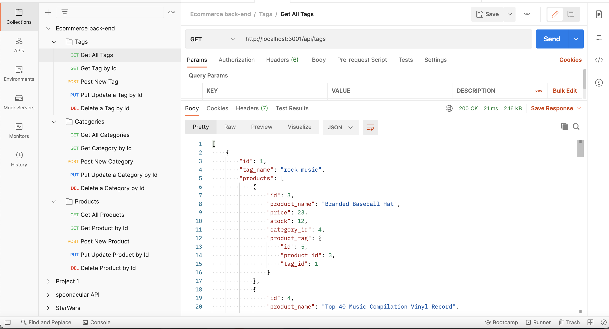

# E-commerce Back End:
This application is used for the back end of an e-commerce business. It uses an Express.js file for the server and then uses MySQL as a database.Sequelize is used as the ORM to run the SQL queries and models. The SQL database includes tables for Tags, Categories, and Products. Using Postman or Insomnia, you are able to GET, POST, PUT, and DELETE in each table.

# How to Use:
You will first need to install all the required npm packages using the command line. Once installed, you will need to run mysql and select the database to be used. Once this is done, quit mysql and use npm run seed. This will seed the database. Then run node server and the port will be listening. Using Postman or Insomnia, you are then able to edit and see the data.

# Processes Used:
- express
- mysql
- sequelize
- node.js
- dotenv

## Usage
[Click here for preview video](https://drive.google.com/file/d/1fz2JQuRmAyYv9KTCJJVukLJjAFjxvEsW/view?usp=sharing)

# Author
- Hanna Munoz
- [Github](https://github.com/hannamunoz)
- [LinkedIn](https://www.linkedin.com/in/hanna-munoz-179993b2/)